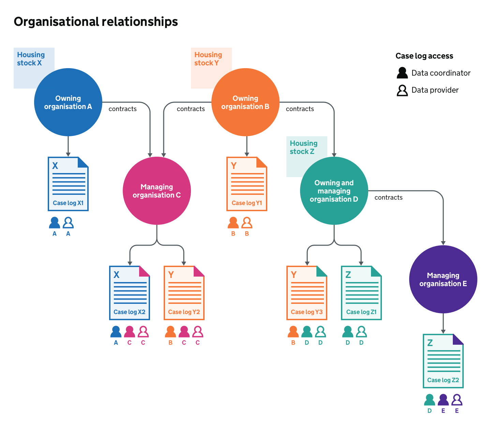
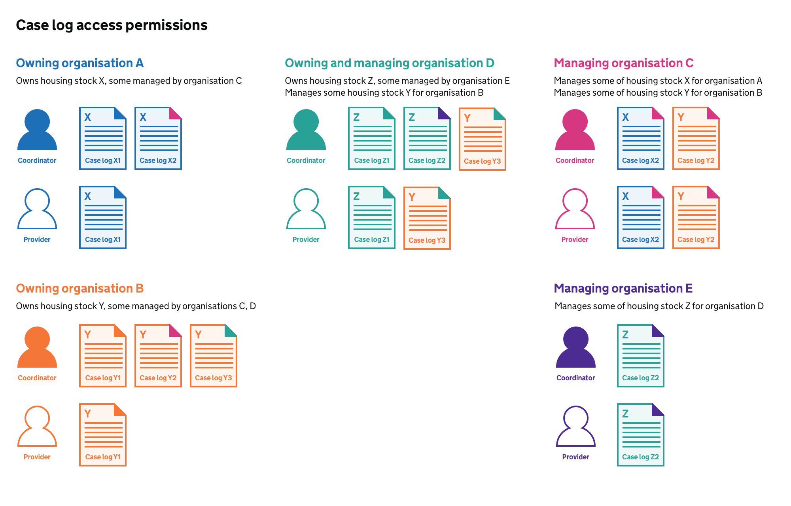

# Organisational relationships

## Definitions

- **Stock owning organisation**: An organisation that owns housing stock. It may manage the allocation of people in and out of their accommodation, or it may contract this out to managing agents.

- **Managing agent**: In scenarios where one organisation owns stock and another organisation is contracted to manage the stock and tenants, the latter organisation is often called a ‘managing agent’. Managing agents are responsible for the allocation of people in and out of the accommodation, and/or responsible for the services provided to support those people in the accommodation (in the case of supported housing).

## Permissions

Organisations that own stock can contract out the management of that stock to another organisation. This relationship is often referred to as a parent/child relationship. This is a useful analogy as a parent can have multiple children, and a child can have many parents. A child organisation can also be a parent, and a parent organisation can also be a child organisation:

The case logs that a user can see depends on their role:

- Customer support users can access any case log

- Data coordinators can access any case log for which the organisation they work for is ultimately responsible for, meaning they can see logs managed by a child organisation

- Data providers can only access case logs for which their organisation manages (or directly owns)

Taking the relationships from the above diagram, and looking at which logs each user can access:

